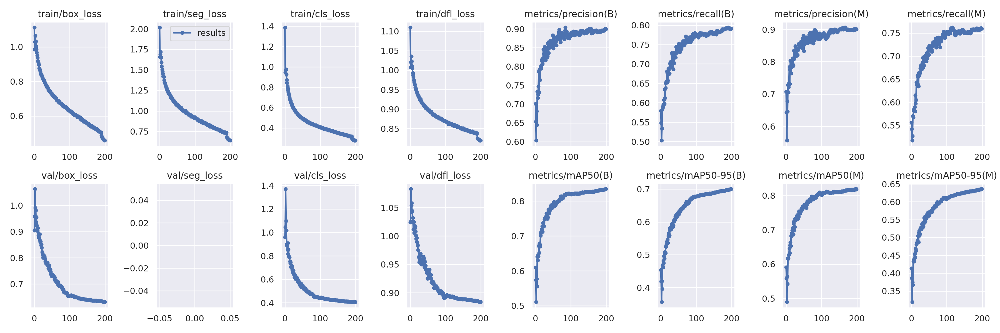
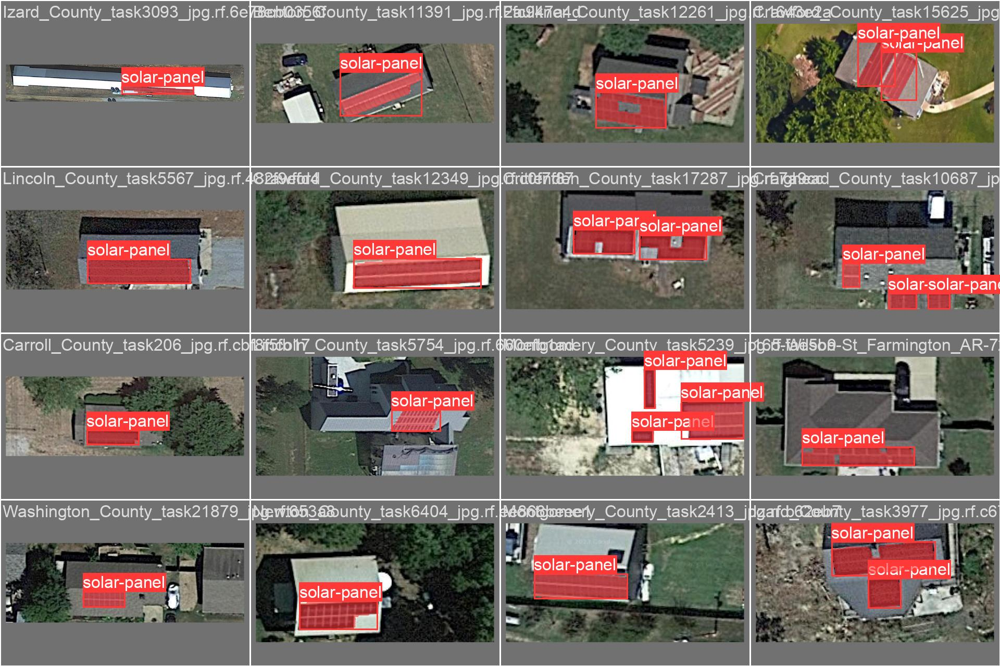
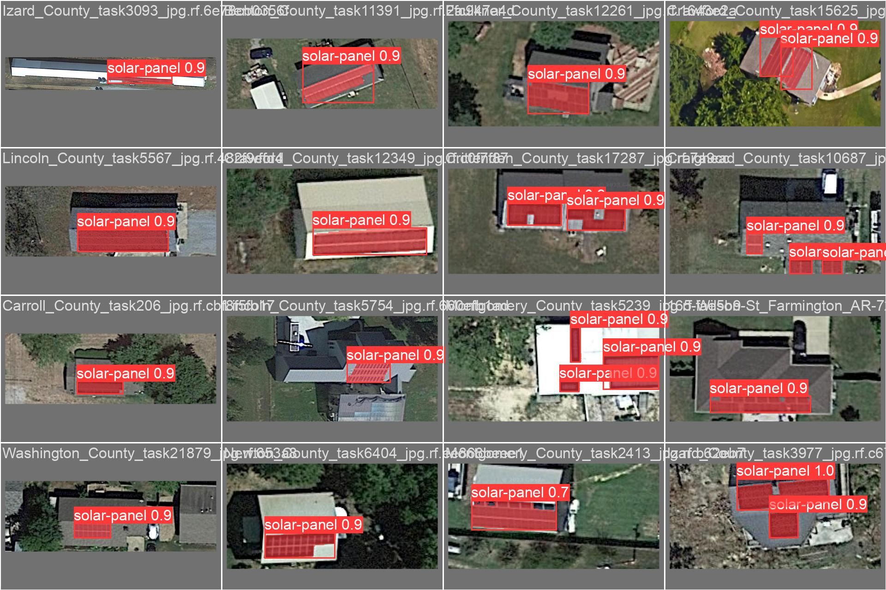

YOLOv8s trained on solar panels dataset https://app.roboflow.com/rzeszow-university-of-technology/solar-panels-seg/2

**Inference API:** [On Roboflow](https://app.roboflow.com/rzeszow-university-of-technology/solar-panels-seg/deploy/2)

## Training results



*Labels:*


*Predictions:*


## How to use

1. Instal ultralytics package. Follow their guide here: [Quickstart](https://docs.ultralytics.com/quickstart/)
2. Clone this repository.
3. Run inference
```sh
yolo segment predict model=best.pt imgsz=640 save=True source=image.png
```
